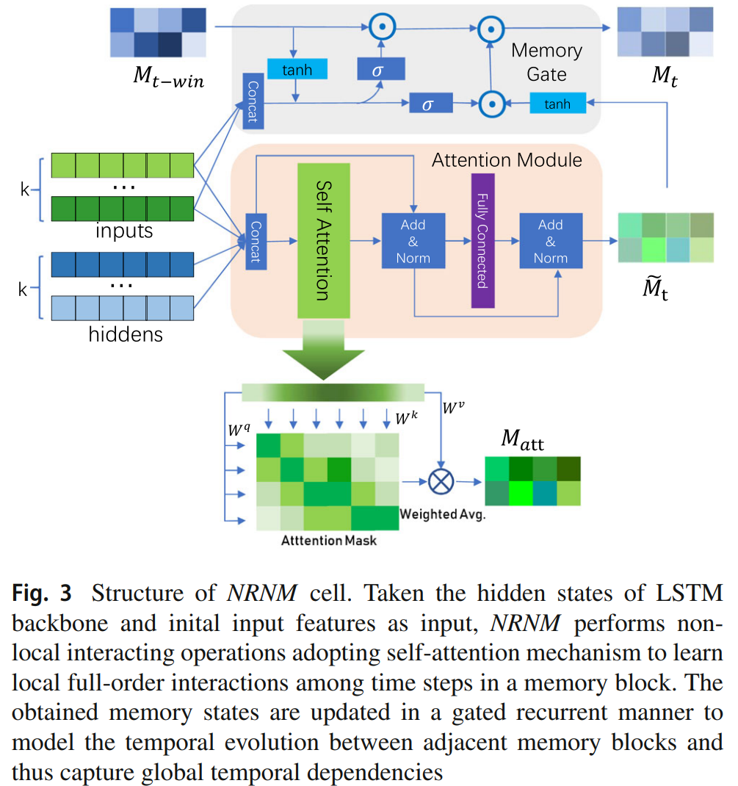
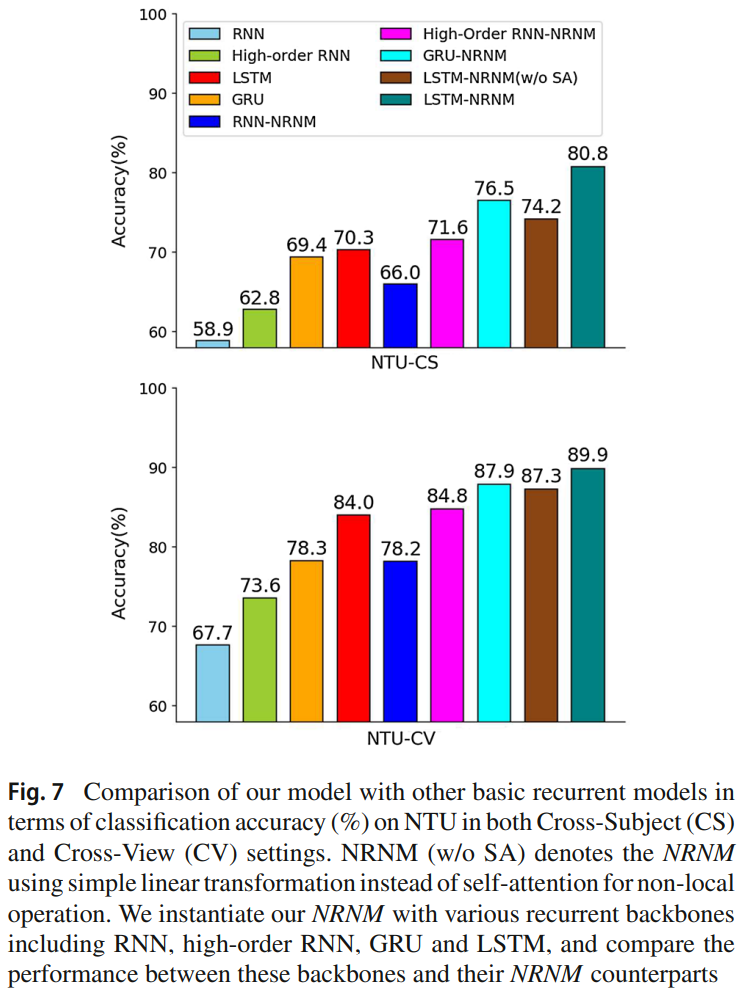

# NRNM: Non-local-Recurrent-Neural-Memory
Official pytorch codes for the paper:

 - [Learning Sequence Representations by Non-local Recurrent Neural Memory (IJCV 2022)](https://link.springer.com/article/10.1007/s11263-022-01648-y) 
 


{height="50%" width="50%"}


 
# Installation
The model is built in PyTorch 1.2.0 and tested on Ubuntu 16.04 environment (Python3.7, CUDA9.0, cuDNN7.5).
You can installa the environment via the following:
```
pip install -r requirements.txt
```

# Example

Training NRNM on NTU-Skeleton dataset
Download the NTU skeleton dataset from [link](https://rose1.ntu.edu.sg/dataset/actionRecognition/), and put it into `./datasets/Skeleton/`.

Run `CUDA_VISIBLE_DEVICES=0 python action_mylstm_cv.py  --nlayers=2 --data_mode=CV --lr=0.001 --cell_type=ORG_MEMO --nhid=512 --sb=cv_MEMO_512_2layer` to train and test LSTM-NRNM for skeleton-based action recognition.


# Citation
If you find this work useful for your research, please cite:
```
@article{pei2022learning,
  title={Learning Sequence Representations by Non-local Recurrent Neural Memory},
  author={Pei, Wenjie and Feng, Xin and Fu, Canmiao and Cao, Qiong and Lu, Guangming and Tai, Yu-Wing},
  journal={International Journal of Computer Vision},
  pages={1--21},
  year={2022},
  publisher={Springer}
}
```
